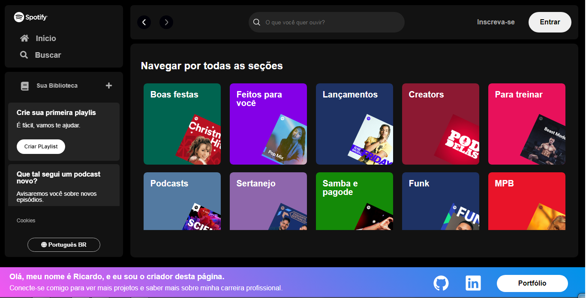

<h1 align="center"> Projeto clonagem Spotify </h1>

Clone do Spotify, desenvolvido para fins educacionais durante a primeira edição da Imersão Dev Front End da Alura.

 

  

## 🚀 Tecnologias

Esse projeto foi desenvolvido com as seguintes tecnologias:

- HTML
- CSS
- JS
- API - created on localhost

---
 
Feito com ♥ by Ricardo.